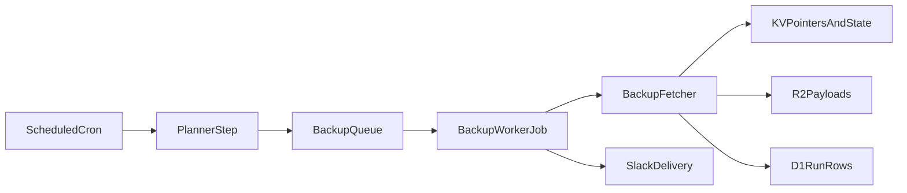

# Platform Evolution

This document turns the scale-oriented roadmap into an implementation sequence that can be delivered incrementally without rewriting the current Worker.

## Current Baseline

- KV remains the source of truth for site configuration, lightweight metadata, latest pointers, progress keys, diff cache, and run status.
- HTML payloads are now written in compressed form and decoded through shared runtime helpers.
- Run records are stored in KV and exposed through `/api/runs` and `/api/sites/overview`.
- The operator console at `/app` is the canonical management surface.

## Target Split

Use each storage layer for the data it handles best:

- `KV`
  - site configuration
  - latest backup pointers
  - in-flight progress state
  - small summaries and cache entries
- `R2`
  - compressed HTML payloads
  - long retention backup bodies
  - export bundles
- `D1`
  - run history
  - searchable diff summaries
  - tenant/account/workspace records
  - audit logs and delivery logs
- `Queues`
  - high-volume crawl fan-out
  - retryable backup jobs
  - digest/summary delivery work

## Stage 1: R2 Payload Mirroring

Goal: move the largest objects out of KV first while keeping metadata reads fast.

Implementation:

- Add an optional `BACKUP_STORAGE` R2 binding.
- Keep `meta:*` and `latest:*` in KV.
- Write payloads to R2 using a deterministic object key:
  - `siteId/date/urlHash.html.gz`
- Extend metadata with a storage pointer:
  - `storageBackend: "kv" | "r2"`
  - `storageKey?: string`
- Read path:
  - try `storageBackend === "r2"` first
  - fall back to KV for legacy content

Rollout:

1. Start dual-writing new backups to both KV and R2.
2. Switch reads to prefer R2.
3. Backfill recent KV payloads into R2.
4. Stop writing large payloads to KV.

## Stage 2: D1 Operational Data

Goal: make history and analytics queryable instead of KV-list based.

Suggested tables:

```sql
create table sites (
  site_id text primary key,
  workspace_id text,
  name text not null,
  base_url text not null,
  created_at text not null,
  updated_at text not null
);

create table backup_runs (
  run_id text primary key,
  site_id text not null,
  trigger text not null,
  status text not null,
  started_at text not null,
  finished_at text,
  total_urls integer not null,
  processed_urls integer not null,
  changed_url_count integer not null,
  failed_backups integer not null,
  failed_stores integer not null,
  execution_time_ms integer,
  summary text not null
);

create table backup_run_notifications (
  run_id text not null,
  channel text not null,
  attempted integer not null,
  delivered integer not null,
  throttled integer not null,
  message text,
  delivered_at text
);

create table url_snapshots (
  site_id text not null,
  url_hash text not null,
  backup_date text not null,
  status integer not null,
  size_bytes integer not null,
  hash text not null,
  normalized_hash text,
  storage_backend text not null,
  storage_key text,
  primary key (site_id, url_hash, backup_date)
);
```

Rollout:

1. Write new run records to both KV and D1.
2. Switch `/api/runs` and `/api/sites/overview` to D1-backed queries.
3. Backfill recent KV run records.
4. Keep KV only for latest status pointers and hot metadata.

## Stage 3: Queue-Backed Orchestration

Goal: stop treating the cron handler as the crawler itself once site count or page count grows materially.

Target flow:



Execution rules:

- Cron only discovers due sites and enqueues work.
- Queue consumers handle one site or one shard at a time.
- Large sites can fan out by URL shard or sitemap partition.
- Retries move to queue semantics instead of reusing cron cadence.

Migration:

1. Keep the current cron loop as the canonical path.
2. Add queue production behind a feature flag.
3. Let consumers process manual triggers first.
4. Move scheduled runs to queue production once parity is proven.

## Stage 4: Multi-Workspace Readiness

Goal: keep the current single-team operator flow while making future account boundaries explicit.

Additions:

- `workspaceId` on site configs and run records
- per-workspace webhook/default settings
- role-based access model:
  - `admin`
  - `operator`
  - `viewer`
- workspace-scoped API filtering

Migration rule:

- never key future data only by `siteId`
- prefer `workspaceId + siteId` boundaries in D1 and object storage

## Near-Term Engineering Hooks

These changes can happen without changing product behavior today:

- Add optional storage pointer fields to metadata once R2 is introduced.
- Keep run-record serialization stable so D1 dual-write can mirror the current KV payload shape.
- Keep `/app` and `/api/runs` as the long-term operator entry points so backend storage can change behind them.

## Exit Criteria

Move to the next stage only when the prior one is operationally boring:

- Stage 1 complete when payload reads come primarily from R2 with no viewer regressions.
- Stage 2 complete when history pages and dashboards no longer depend on KV scans.
- Stage 3 complete when cron only plans work and queue consumers handle production volume reliably.
- Stage 4 complete when workspace scoping exists across API, storage, and operator UI.
